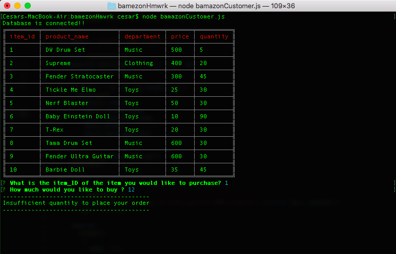

# Bamazon CLI App

## Description
In this project, I be created an Amazon-like storefront with the MySQL,inquirer, Node, and CLI npm packages. The app can take in orders from customers and deplete stock from the store's inventory. I also have a file called bamazonManageer where a manager can see view producs for sale,  view low inventory, add to inventory, and add new products.

## Technologies Used 

1. Inquierer NPM package
2. CLI NPM package
3. MYSQL NPM package
4. Node.js

## How to Use

